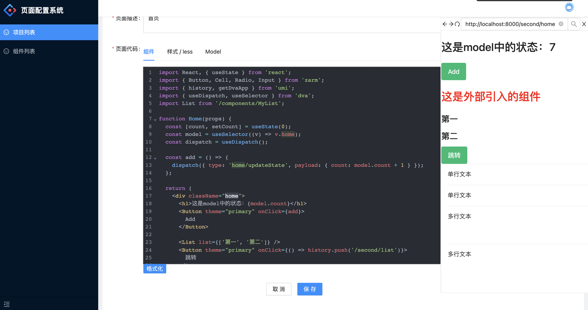

# 页面配置系统
- 技术栈 egg-mysql、umi
> 一套简单的页面配置系统，在管理后台创建项目，项目下创建页面，页面中可以添加组件代码，支持实时预览，前端组件代码全部保存在数据库，通过接口请求加载组件代码，灵活配置页面与组件

## egg-mysql
> 提供后台与应用的接口服务
- 项目增删改查
- 页面增删改查
- 支持代码中import外部依赖解析
- 支持代码中引入内部组件的解析

## umi-cms
> 项目与页面的配置后台
- 项目列表
- 项目增删改
- 页面列表
- 页面增删改
- js与css代码编辑
- 配置应用实时预览

## umi-app
> 后台配置的项目通过该应用展示
- 通过项目code加载不同项目
- 通过页面路径，加载不同页面配置
- 动态加载接口返回的页面组件代码与样式
- 支持内部组件的引入

## TODO
- 保存代码格式化
- 保存代码语法检查